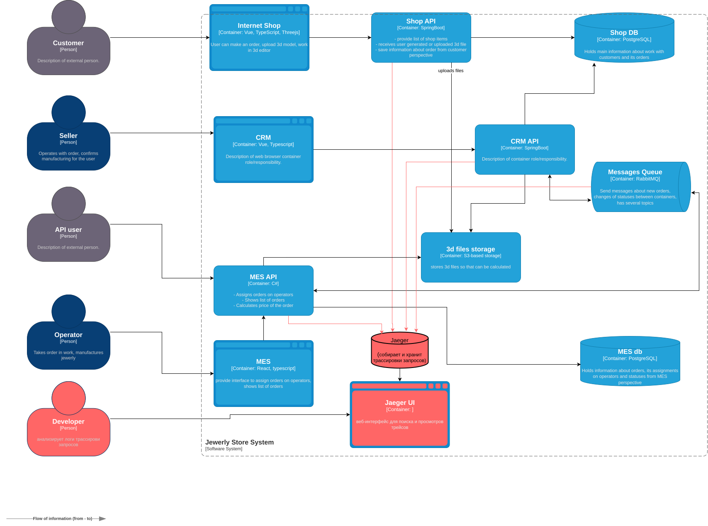

# Архитектурное решение по трейсингу

## Мотивация
Трейсинг даст понимание, в каком сервисе застрял заказ.

На какие метрики повлияет введение трейсинга:
- Снижение времени расследования багов.
- Повышение стабильности (меньше отмен заказов).
- Улучшение SLA (срок обработки заказов).
- Рост NPS (удовлетворённости клиентов).

## Предлагаемое решение
диаграмма контейнеров C4 в .drawio  
[Спринт 3. Архитектурное решение по трейсингу](jewerly_c4_model.drawio)

То же самое в виде картинки:

## Компромиссы
- Придётся доработать все микросервисы — затраты на разработку
- Увеличение времени обработки запросов
- Увеличение потребления ресурсов, дополнительное расходы на хранение логов трассировки

## Безопасность
- Jaeger доступен только из VPN.
- Авторизация через корпоративный SSO.
- Доступ только для ролей Dev.