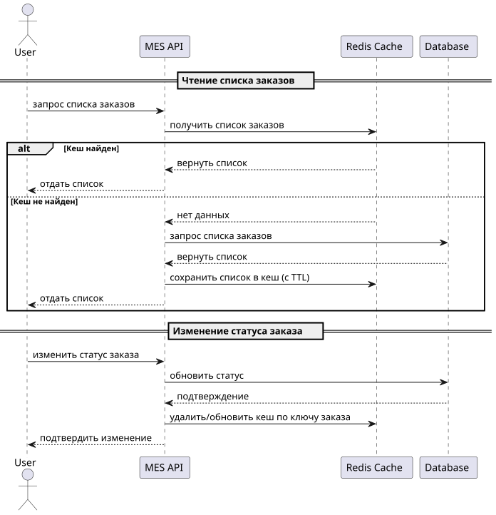

# Архитектурное решение по кешированию

## Мотивация
Страница заказов в MES тормозит, заказы обрабатываются медленно → пользователи недовольны → бизнес теряет деньги. Нужно ускорить. Причина — база данных и API тупят под нагрузкой. Кеширование снимет часть запросов с БД и ускорит доступ к часто используемым данным (например, список заказов).

## Предлагаемое решение
- Тип кеширования: серверное.
    - Клиентское не спасёт — страница слишком динамическая, данные часто меняются.
    - Паттерн: Cache-Aside (чтение через кеш → промах → БД → запись в кеш).
    - Логика: при чтении сначала спрашиваем кеш, если пусто — идём в базу и запоминаем.
    - Write-Through и Refresh-Ahead не подходят: они перегружают запись и не решат главную проблему — нагруженное чтение.

- Что кешируем:
    - Список заказов
    - Детали по заказу
    - Часто используемые справочники (статусы, типы заказов)

- Куда кешируем:
    - Redis.

### Диаграмма последовательности действий
диаграмма последовательности действий в .puml  

То же самое в виде картинки:

### Стратегия инвалидации кеша
Выберем стратегию по ключу (для заказа) + TTL (для списка заказов).

- По ключу. При изменении заказа вручную выкидываем конкретный ключ. Всегда отображаем актуальный заказ (например, при проваливании в заказ из списка заказов).
- Временная (TTL). Просто, надёжно. Например, 30 секунд для списка заказов. А дальше дополнительную проверку актуальности при действии сотрудника (попытка взятия заказа).
- Программная. Преждевременное усложнение.